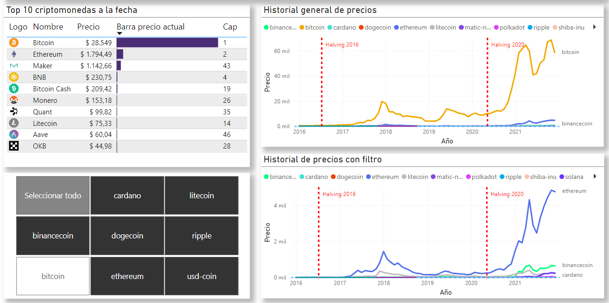
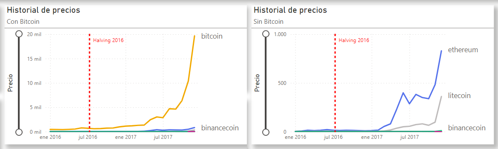
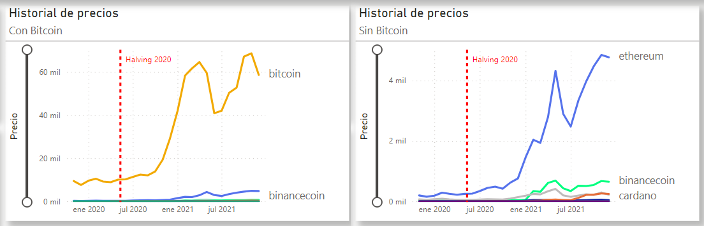
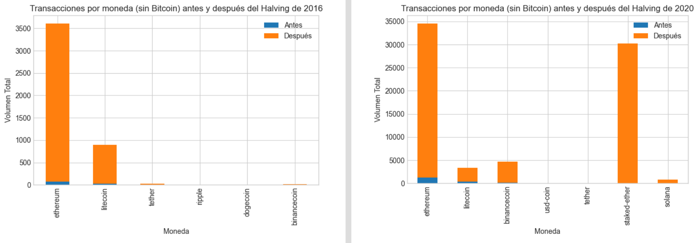
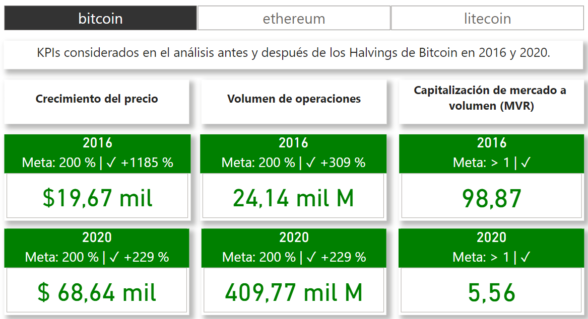

# Análisis de Datos - Criptomonedas

## Índice

1. [Descripción del Proyecto](#descripción-del-proyecto)
2. [Estructura del Repositorio](#estructura-del-repositorio)
3. [Conjuntos de Datos Utilizados](#conjuntos-de-datos-utilizados)
4. [Metodología](#metodología)
5. [Conclusiones generales](#conclusiones-generales)
6. [Análisis por KPIs](#análisis-por-kpis)
7. [Recomendaciones de Inversión](#recomendaciones-de-inversión)
8. [Contacto](#contacto)
9. [Tecnologías Utilizadas](#tecnologías-utilizadas)

# Análisis de Datos - Criptomonedas

## Descripción del Proyecto

En este repositorio, se presenta un análisis exhaustivo de diversos conjuntos de datos relacionados con criptomonedas, con una atención especial en el análisis de los precios y volúmenes de transacción previos y posteriores a eventos cruciales, como los halvings de Bitcoin.

## Estructura del Repositorio

La estructura del repositorio se organiza de la siguiente manera:

**- data:** Contiene los conjuntos de datos históricos utilizados en el análisis. Estos conjuntos de datos incluyen información esencial sobre los precios, volúmenes y capitalización de mercado de diferentes criptomonedas.

**- etl-eda:** Incluye archivos Jupyter Notebook que detallan cada paso del proceso de análisis. Desde la adquisición y limpieza de datos hasta la exploración de datos y la generación de visualizaciones perspicaces.

**- dashboard:** Contiene el archivo SQL utilizado como base de datos para el tablero Power BI. El tablero proporciona una representación visual interactiva de los hallazgos clave del análisis.

**- README.md:** El archivo actual que estás leyendo proporciona una visión general del proyecto, su estructura y sus resultados clave.

## Conjuntos de Datos Utilizados

Este proyecto se basa en la utilización de conjuntos de datos históricos que contienen información sobre precios y volúmenes de negociación de diversas criptomonedas. Entre las criptomonedas analizadas se encuentran Bitcoin, Ethereum, Litecoin, Binance Coin, USD Coin y otras de las 15 de mayor capitalización actual en el mercado de criptomonedas.

El enfoque en Bitcoin es especialmente relevante debido a su posición como la primera y más grande criptomoneda. Los eventos que afectan a Bitcoin tienden a influir en todo el mercado de criptomonedas, lo que lo convierte en un punto central en el análisis.

## Metodología

El proceso metodológico seguido en este proyecto puede resumirse en las siguientes etapas:

**- Adquisición y Preparación de Datos:** Se obtuvieron conjuntos de datos históricos de fuentes confiables. Estos datos se sometieron a un riguroso proceso de limpieza y transformación para garantizar la coherencia y confiabilidad de los resultados.

**- Exploración de Datos:** Se realizó un análisis exploratorio profundo de los datos. Se identificaron patrones, tendencias y relaciones significativas a través de la generación de gráficos, estadísticas descriptivas y análisis de correlación.

**- Visualización:** Se crearon visualizaciones efectivas utilizando diversas herramientas, como gráficos de líneas y gráficos de dispersión. Estas visualizaciones ayudaron a representar de manera clara y comprensible la evolución de los precios y volúmenes a lo largo del tiempo.

**- Análisis Comparativo de Eventos:** Se realizó un análisis comparativo en profundidad de los datos antes y después de los halvings de Bitcoin. Esto permitió identificar cambios y tendencias destacadas en los precios y volúmenes de negociación en relación con estos eventos cruciales.

## Conclusiones generales

Este proyecto de análisis de datos de criptomonedas ha permitido una exploración exhaustiva y detallada del comportamiento de diversas criptomonedas. Se ha puesto un énfasis particular en el estudio de patrones de precios y volúmenes de transacción en diferentes intervalos de tiempo, así como en la evaluación del impacto de eventos significativos, como los halvings de Bitcoin.

El análisis ha demostrado que Bitcoin ha experimentado aumentos significativos en el precio después de cada halving, lo que puede ser una consideración importante para los inversores. Además, otras criptomonedas como Ethereum y Litecoin también han mostrado patrones de crecimiento interesantes en relación con los halvings.

### Halving de Bitcoin y Minería

El halving de Bitcoin es un evento programado que ocurre aproximadamente cada cuatro años. Durante un halving, la recompensa otorgada a los mineros por agregar un nuevo bloque a la cadena de bloques de Bitcoin se reduce a la mitad. Este proceso tiene como objetivo controlar la inflación y limitar la cantidad total de Bitcoin que puede estar en circulación.

El proceso de minería es fundamental para el funcionamiento de Bitcoin y otras criptomonedas. Los mineros utilizan su poder de procesamiento para resolver problemas matemáticos complejos y validar transacciones en la red. Los halvings afectan directamente los incentivos y las recompensas de los mineros, lo que puede influir en la seguridad y la estabilidad de la red.

## Análisis por KPIs

**- Porcentaje de Crecimiento Post-Halving**

El KPI de Porcentaje de Crecimiento Post-Halving mide el promedio de crecimiento de los precios de las criptomonedas después de cada halving. Se observó que en los halvings anteriores de Bitcoin (2016 y 2020), el precio de Bitcoin experimentó un aumento significativo en los meses posteriores a los eventos.
Este patrón sugiere que los halvings pueden tener un impacto positivo en el precio de Bitcoin, lo que podría ser una oportunidad de inversión para los interesados en criptomonedas.

**- Volumen de Operaciones Post-Halving**

El KPI de Volumen de Operaciones Post-Halving analiza el volumen promedio de operaciones de las criptomonedas después de un halving. Se observó que el volumen de operaciones de Bitcoin experimentó un aumento notorio en los meses posteriores a los halvings anteriores. Este aumento en el volumen podría indicar un mayor interés y actividad en el mercado, lo que podría ser una señal de oportunidades de inversión.
El aumento en el volumen de operaciones podría reflejar tanto a inversores existentes como a nuevos participantes que ingresan al mercado debido a la expectativa de un aumento en el precio de Bitcoin.

**- Ratio de Capitalización de Mercado a Volumen (MVR)**

Si se busca una inversión con una moneda más estable a mediano y largo plazo, un MVR (relación entre capitalización de mercado y volumen) mayor a 1 es un buen indicador, ya que sugiere que el valor total de mercado de una empresa es relativamente más alto que el volumen de sus transacciones diarias. En contraste, un MVR menor a 1 podría señalar una alta actividad de compra y venta, lo que puede vincularse con una mayor volatilidad y riesgo debido a operaciones a corto plazo y especulativas en lugar de inversiones estables a largo plazo.

## Recomendaciones de Inversión

Basándonos en las conclusiones del análisis, se presentan las siguientes recomendaciones de inversión:

**1. Bitcoin (BTC):** Considerando que el próximo halving de Bitcoin está programado para julio de 2024, y siguiendo la tendencia observada en los halvings anteriores, se sugiere que Bitcoin podría experimentar un aumento significativo en su precio después de este evento. Dado su historial y posición dominante en el mercado de criptomonedas, Bitcoin se considera una inversión sólida y relativamente segura a mediano y largo plazo.

**2. Ethereum (ETH):** Ethereum ha demostrado ser otra criptomoneda con un patrón de crecimiento interesante después de los halvings de Bitcoin. Con el crecimiento del ecosistema de finanzas descentralizadas (DeFi) y la transición a Ethereum 2.0, es probable que Ethereum continúe siendo una inversión atractiva.

**3. Litecoin (LTC):** Aunque con patrones de crecimiento ligeramente más moderados que Bitcoin y Ethereum, Litecoin ha mostrado un aumento significativo después de los halvings anteriores. Es una opción a considerar para aquellos que buscan diversificar su cartera de criptomonedas.

# Contacto

### Claudia Caceres

 

## Tecnologías utilizadas

Python | Pandas | Matplotlib | Seaborn | MySQL | Power BI

---

_Nota: Este documento es una representación simplificada del proyecto de análisis de datos de criptomonedas y tiene fines ilustrativos. Las conclusiones y recomendaciones presentadas son hipotéticas y no constituyen asesoramiento financiero real._
# analisis_de_datos_criptomonedas
